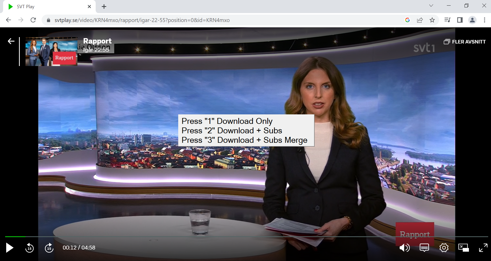

# svtplay-dl-helper
Downloader for svtplay-dl

svtplay-dl-helper is a utility to facilitate downloads in any browser with the popular  
svtplay-dl program https://svtplay-dl.se/

_**Features**_
 - _Should work with all browsers_
 - _Can download subtitles_
  - _Automatic merge of subtitles with video as an option_
  
  **Instructions**  
Put svtplay-dl-helper.exe in a folder of your choice.  
First time you run it it will create a settings file called svtplay-dl.ini in the same directory.  
Open that file with a texteditor and edit the path to svtplay-dl.exe.  
(if you added svtplay-dl.exe to the windows path environment variable just put in svtplay-dl)

Also edit the path to your desired download location for the videos.  
If you want to change the shortcut key **Ctrl + p** you can do that as well to start the download process.

Example below:
```
[Options]
ProgramPath=C:\ffmpeg\bin\svtplay-dl\svtplay-dl.exe
Outputfolder=C:\ffmpeg
Shortcut=p
```
Created in Autohotkey

Hoppas du gillar programmet!

## Screenshot

<p align="center"></p>
